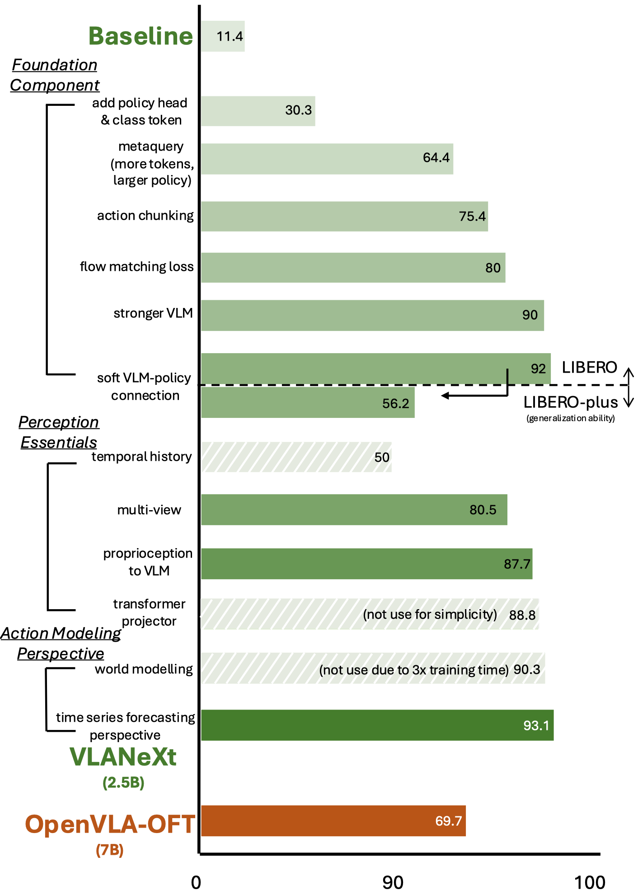
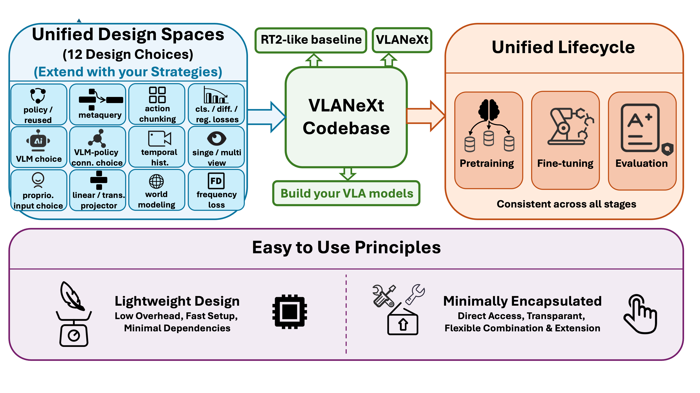
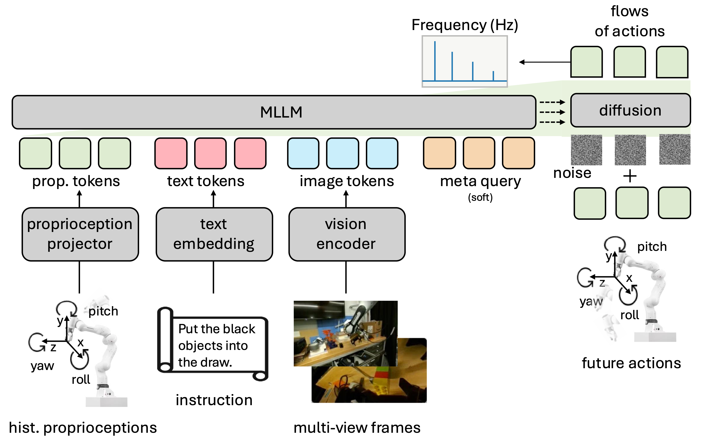

# VLANeXt: Recipes for Building Strong VLA Models

[](https://arxiv.org/abs/2602.18532)
[](https://dravenalg.github.io/VLANeXt)
[](https://huggingface.co/DravenALG/VLANeXt)
[](https://github.com/DravenALG/awesome-vla-wam)

<p align="center">

</p>

> 🎉 **Good News!** Our paper has been accepted to **ICML 2026**!

This is a PyTorch implementation of the paper: [VLANeXt: Recipes for Building Strong VLA Models](), and also a **unified**, **easy-to-use** codebase that standardizes training and evaluation while exposing the key components of the VLA design space. It is intentionally lightweight and minimally encapsulated, enabling researchers to reproduce results, probe alternative design choices, and build new VLA variants on a shared, transparent foundation. We also release a [curated and continuously updated list of VLA & WAM research](https://github.com/DravenALG/awesome-vla-wam) (Awesome VLA & WAM) to help better understand the development of VLAs.

**Xiao-Ming Wu**, Bin Fan, Kang Liao, Jian-Jian Jiang, Runze Yang, Yihang Luo, Zhonghua Wu, Wei-Shi Zheng, Chen Change Loy*.

S-Lab, Nanyang Technological University; Sun Yat-sen University; ACE Robotics.

<p align="center">

</p>

Let's build the future of VLAs together! If you have any questions, feel free to contact me by xiaoming.wu@ntu.edu.sg.

## 🛠️ Environment Setup

### Basic Installation
```bash
# Basic setup 
conda create -n VLANeXt python=3.10
conda activate VLANeXt
pip install torch==2.4.0 torchvision==0.19.0 torchaudio==2.4.0 --index-url https://download.pytorch.org/whl/cu124
pip install -r requirements.txt
pip install flash-attn --no-build-isolation
conda install -c conda-forge ffmpeg
```

### Benchmark Installation

**LIBERO**
```bash
cd third_party
git clone https://github.com/Lifelong-Robot-Learning/LIBERO.git
cd LIBERO && pip install .
```

**LIBERO-plus** (Separate env needed)
```bash
cd third_party
git clone https://github.com/sylvestf/LIBERO-plus.git
cd LIBERO-plus && pip install .
# Dependencies
apt install libexpat1 libfontconfig1-dev libpython3-stdlib libmagickwand-dev
pip install -r extra_requirements.txt
conda env config vars set LIBERO_CONFIG_PATH=~/.libero_plus
```
We also need to download the asserts, see [LIBERO-plus](https://github.com/sylvestf/LIBERO-plus).


## 🚀 Training
Droid dataset is for robotics pretraining (used in our real-world experiments), and libero dataset is for benchmark evaluation (used in our benchmark evaluation).
<p align="center">

</p>

### 🧪 Design Space Exploration
We provide a tutorial-style guide to configuring the **12 design spaces** from our paper.

👉 **Please refer to [DESIGN_SPACE.md](DESIGN_SPACE.md) for detailed configuration instructions.**

### Droid Dataset
For more details, please refer to the [Droid Dataset](https://droid-dataset.github.io).

**Download**:
```bash
gsutil -m rsync -r gs://gresearch/robotics/droid/1.0.1 droid/1.0.1/ 
```

**Run Training**:
```bash
# Single GPU
CUDA_VISIBLE_DEVICES=0 python -m scripts.train --config config/droid_train_config.yaml

# Multi-GPU (Set distributed=true in config)
CUDA_VISIBLE_DEVICES=0,1,2,3 torchrun --nproc_per_node=4 --master_port=29505 -m scripts.train --config config/droid_train_config.yaml
```

### LIBERO Dataset
For more details, please refer to the [OpenVLA](https://github.com/openvla/openvla), which modifies the original dataset in LIBERO for training VLAs.

**Download**:
```bash
hf download openvla/modified_libero_rlds --repo-type dataset --local-dir LIBERO_modified
```

**Run Training**:
```bash
# Single GPU
CUDA_VISIBLE_DEVICES=0 python -m scripts.train --config config/libero_train_config.yaml

# Multi-GPU (Set distributed=true in config)
CUDA_VISIBLE_DEVICES=4,5,6,7 torchrun --nproc_per_node=4 --master_port=29506 -m scripts.train --config config/libero_train_config.yaml
```

## 📊 Evaluation
We have released VLANeXt checkpoints for the four LIBERO or LIBERO-plus suites on [huggingface](https://huggingface.co/DravenALG/VLANeXt).

### LIBERO
For more details, please refer to the [official repository of LIBERO](https://github.com/Lifelong-Robot-Learning/LIBERO).

```bash
unset PYTHONPATH
export PYTHONPATH=$PYTHONPATH:/data/NTU_slab/draven/proj/third_party/LIBERO

CUDA_VISIBLE_DEVICES=0 MUJOCO_EGL_DEVICE_ID=0 python -m scripts.libero_bench_eval
```

### LIBERO-plus
For more details, please refer to the [official repository of LIBERO-plus](https://github.com/sylvestf/LIBERO-plus).

```bash
unset PYTHONPATH
export PYTHONPATH=$PYTHONPATH:/data/NTU_slab/draven/proj/third_party/LIBERO-plus

CUDA_VISIBLE_DEVICES=0 MUJOCO_EGL_DEVICE_ID=0 python -m scripts.libero_plus_bench_eval
```

## ⚡ Analysis
**Model Size and Speed**  
Set `CHECKPOINT_PATH` and `INPUT_MODALITY` in `scripts/size_speed_eval.py`.

```bash
CUDA_VISIBLE_DEVICES=0 python -m scripts.size_speed_eval
```

## ❗ Common Issues
If you run into issues, check [COMMON_ISSUES.md](COMMON_ISSUES.md) for known problems and solutions.

## 📚 Citation

If you find VLANeXt useful for your research or applications, please cite our paper using the following BibTeX:

```bibtex
  @article{wu2026vlanext,
      title={VLANeXt: Recipes for Building Strong VLA Models}, 
      author={Xiao-Ming Wu and Bin Fan and Kang Liao and Jian-Jian Jiang and Runze Yang and Yihang Luo and Zhonghua Wu and Wei-Shi Zheng and Chen Change Loy},
      journal={arXiv preprint arXiv:2602.18532},
      year={2026},
  }
```

## 🗞️ License
This project is licensed under [NTU S-Lab License 1.0](LICENSE).